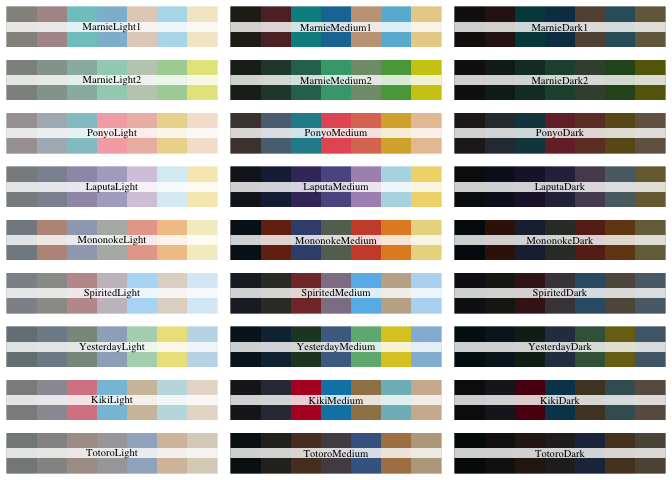

# ghibli 

[](https://www.tidyverse.org/lifecycle/#stable)
[](https://cran.r-project.org/package=ghibli)
[](http://cran.rstudio.com/web/packages/ghibli/index.html)
[](https://github.com/ewenme/ghibli/actions)

## Overview

> “No matter how many weapons you have, no matter how great your
> technology might be, the world cannot live without love!” —*Castle in
> the Sky (1986)*

｡◕‿‿◕｡ Sprinkle some Studio Ghibli palette magic over your plots ｡◕‿‿◕｡

    #> Warning: Package `magick` is required to draw images. Image not drawn.

<!-- -->

## Installation

Install the latest stable version on CRAN…

``` r
install.packages('ghibli')
```

…or get the development version from GitHub.

``` r
# install package from github
remotes::install_github("ewenme/ghibli")
```

## Palettes


`ghibli` provides 9 unique palettes, with a light, medium and dark
variant for each.

``` r
# load package
library(ghibli)

# display palettes w/ names
par(mfrow=c(9,3))
for(i in names(ghibli_palettes)) print(ghibli_palette(i))
```

<!-- -->

**N.B.** the palettes are [exposed in YAML
format](https://raw.githubusercontent.com/ewenme/ghibli/master/inst/extdata/palettes.yml)
for easier porting to new libraries.

All colour palettes are stored as `color` objects (courtesy of the
[prismatic](https://emilhvitfeldt.github.io/prismatic/index.html)
package) inside `ghibli_palettes` with extremely cute printing (if
[crayon](https://github.com/r-lib/crayon) is installed) and plotting
methods to help you preview flavours.


## In the wild

`ghibli` provides relevant scales for use with `ggplot2`. It only
suggests `ggplot2` in order to stay lightweight, but if available you
can use the `scale_[colour|fill]_ghibli_[c|d]()` functions:

``` r
library(ggplot2)

# ggplot stuff
ggplot(iris, aes(Sepal.Length, Sepal.Width, color = Species)) +
  geom_jitter(size = 3) +
  theme_minimal() +
  # ghibli stuff
  scale_colour_ghibli_d("LaputaMedium", direction = -1)
```

<!-- -->

## Other stuff

-   Get citation information for ghibli in R with
    `citation(package = 'ghibli')`
-   Please note that the ghibli project is released with a [Contributor
    Code of
    Conduct](https://ewenme.github.io/ghibli//CODE_OF_CONDUCT.html). By
    contributing to this project, you agree to abide by its terms.
-   This package was largely inspired by [Karthik Ram’s `wesanderson`
    package](https://github.com/karthik/wesanderson)
-   The palettes themselves come from [Movies in
    Color](http://moviesincolor.com/). Go check ’em.
